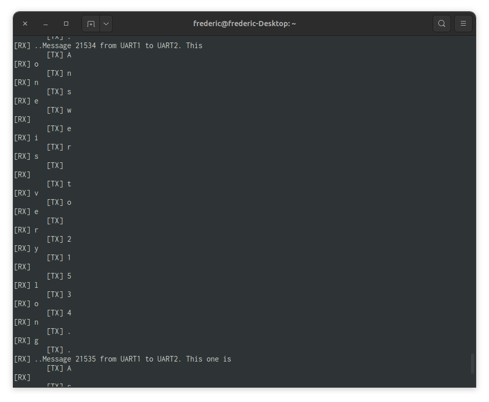
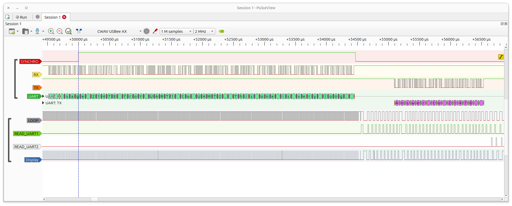
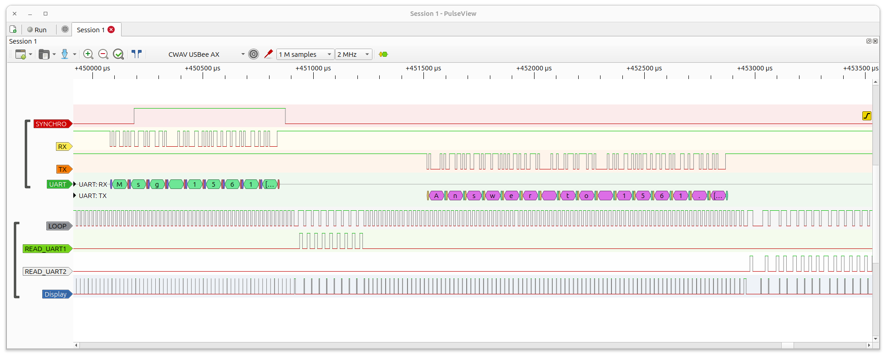

Debug sniff
============

# Hardware configuration
- An Arduino 2560 used as a simulator.
- Lilygo T-Display
- USB-AX Pro Logic analyzer

# Simulator behavior
The Arduino simulate the exchanges between equipments.

1. Serial1 sends a numbered message (either a long or a short one).
2. Serial2 reads the message
3. Serial2 extracts the number from the received message and generates an answer
4. Serial2 sends the message
5. Serial1 receive the message wait for a delay sets by the user
6. loop to 1.

# sniff

## How it works
Once the configuration is done, sniff is a loop.  
At each loop both serial are read.  
If there is a data, it is displayed immediatly if in ASCII or HEXA mode or placed in a buffer, in MIXED mode.  
For all modes, if there is an UART change a new line is created and a header added to show which uart is sending data.  
For all modes, if there is a certain amount of data already displayed a new line is created.  
For the MIXED mode as the data are in a buffer. The buffer must be displayed on uart change, if the buffer is full or if no data has been received for a certain time (currently 2s).  

## The code
1. look if the user has sent some command to change the displaying mode or exit
    1. if so change the mode or exit
2. look if there is a char pending in Serial1 or Serial2
    1. if so read the pending character
    2. fill a struct with the character and UART ID
    3. push the struct in a FIFO
3. Test if FIFO is not empty
    1. if so extract the struct from the FIFO
    2. test if this is the same UART as in the previous data
        1. if so mark uartChanged
    3. if in mixed mode and uart changed
        1. display the buffer
        2. clear the buffer
    4. displays the data according to the active mode
        1. if in ASCII mode, display the data as is
        2. if in HEXA mode, format in hex and display
        3. if in MIXED mode
            1. put the HEX in the first part of the buffer
            2. put the ASCII in the second part of the buffer
            3. if buffer full
                1. display the buffer
                2. clear the buffer
4. if in MIXED mode and no data received since TIMEOUT_MIXED time
    1. display the buffer
    2. clear the buffer
5. loop to 1.

## The problem
Data are displayed in the wrong order on the terminal. The message are sent one after the other and the data should be displayed the same.  

Some signals have been added to help understand the problem.

- SYNCHRO: sent by the simulator during first part of the cycle. used to synchronize logic analyzer
- LOOP: toggle at each loop iteration when testing the UART, thin when there is no data, larger if reading one (or both) of the UART(s)
- READ_UART1: HIGH while reading 1 data from UART1 buffer
- READ_UART2: HIGH while reading 1 data from UART2 buffer
- Display: HIGH during "printing" ASCII or HEX data or flushing MIXED buffer

As it can be seen on the screen capture, data from the UARTs are not read immediatly but only after the full message has been received (or maybe after a timeout, need to be tested).  
That's really weird as available() is supposed to be set when there is at least 1 data in the buffer but here, that's not the case. It behaves the same whichever the length of the message is.  
Screenshot of a long message  

Screenshot of a short message  

